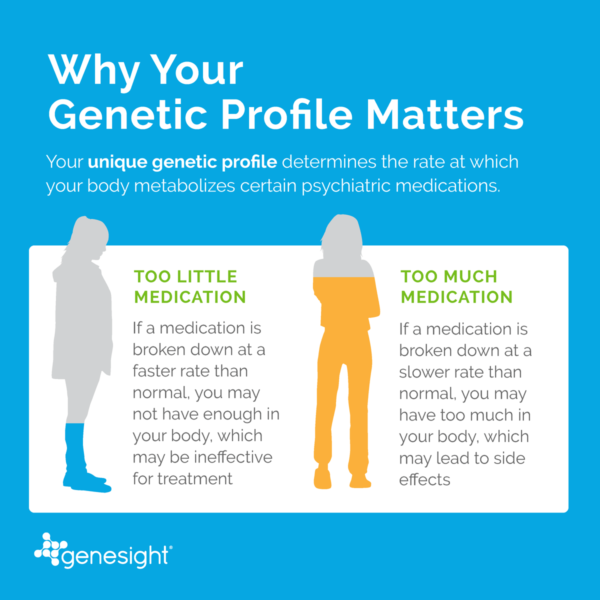
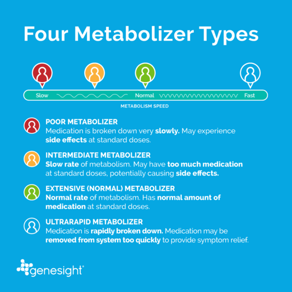
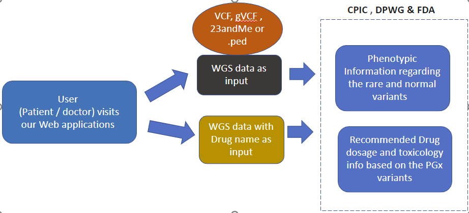
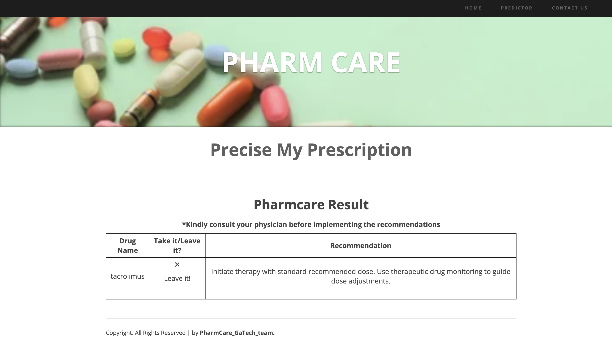
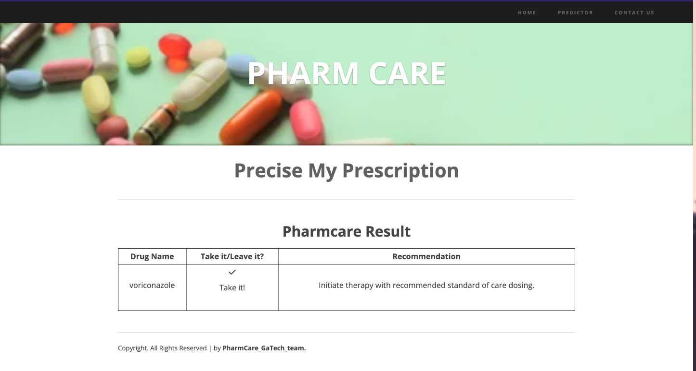

# !PharmCare(assets/intro_dosage.png)
This is the codebase for the PHARM CARE project, which employs PyPGx. PyPGx can predict PGx genotypes (e.g. *4/*5) and phenotypes (e.g. Poor Metabolizer) using genomic data from next-generation sequencing (NGS), single nucleotide polymorphism (SNP) arrays, and long-read sequencing.

Link to the webserver - http://161.35.61.155:5000/

# Aim of the project
To use Pharmacogenomic based information to predict the usage and the recommendation associated with the drug based on users WGS report.

Classification of drug Metabolization :- 

# Method

Input files accepted - <b>vcf, vcf.gz, txt(23andMe)</b>

The application on the backend uses PyPgx to call star alleles for the pharmaco-genes (a single pipeline is run for one gene), along with thre other outputs, this gives the phenptype of the variant as well, which in turn , can be used to get the recommendations for the partiuclar gene-drug pair.

# Requirement Installation
1. git clone  https://github.com/docmab23/Pharmacogenomics-Deepvariant.git

2. git clone https://github.com/sbslee/pypgx-bundle.git (in your home directory)

3. pip install -r requirements.txt

# Interface

The user interface takes in the vcf file (in .gz , .vcf format) and the drug of interest (from the drop down list) and eventually outputs whether the drug can be taken or not, along with the clinical recommendations in the database.

# References
1. Wroblewski et al., 2022. Pharmacogenetic variation in Neanderthals and Denisovans and implications for human health and response to medications. bioRxiv.

2. Botton et al., 2020. Phased Haplotype Resolution of the SLC6A4 Promoter Using Long-Read Single Molecule Real-Time (SMRT) Sequencing. Genes.

3. Lee et al., 2019. Calling star alleles with Stargazer in 28 pharmacogenes with whole genome sequences. Clinical Pharmacology & Therapeutics.

4. Lee et al., 2018. Stargazer: a software tool for calling star alleles from next-generation sequencing data using CYP2D6 as a model. Genetics in Medicine.

